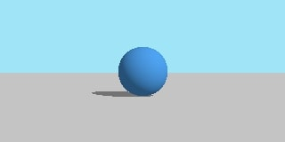
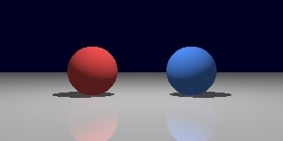
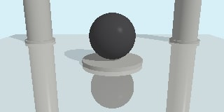
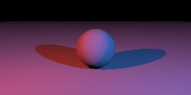
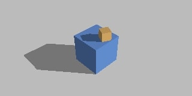
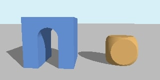
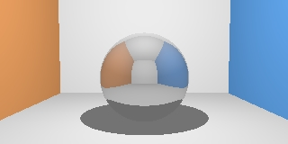
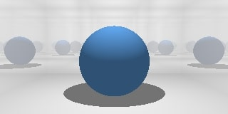

# Python ray tracer
This project is developing by a student from Moscow Aviation Institute. Its purpose is to create a 3d objects renderer, which uses ray tracing method.
```
@@@@@@@@@@@@@@@@@@@@@@@@@@@@@@@@@@@@@@@@@@@@@@@@@@@@@@@@@@@@@@@@@@@@@@@@@@@@@@@@
@@@@@@@@@@@@@@@@@@@@@@@@@@@@@@@@@@@@@@@@@@@@@@@@@@@@@@@@@@@@@@@@@@@@@@@@@@@@@@@@
@@@@@@@@@@@@@@@@@@@@@@@@@@@@@@@@@@@@@@@@@@@@@@@@@@@@@@@@@@@@@@@@@@@@@@@@@@@@@@@@
@@@@@@@@@@@@@@@@@@@@@@@@@@@@@@@@@@@@@@@@@@@@@@@@@@@@@@@@@@@@@@@@@@@@@@@@@@@@@@@@
@@@@@@@@@@@@@@@@@@@@@@@@@@@@@@@@@@@@@@@@@@@@@@@@@@@@@@@@@@@@@@@@@@@@@@@@@@@@@@@@
@@@@@@@@@@@@@@@@@@@@@@@@@@@@@@@@@@@@@@@@@@@@@@@@@@@@@@@@@@@@@@@@@@@@@@@@@@@@@@@@
@@@@@@@@@@@@@@@@@@@@@@@@@@@@@@@@@@@:::!!!!!!!!@@@@@@@@@@@@@@@@@@@@@@@@@@@@@@@@@@
@@@@@@@@@@@@@@@@@@@@@@@@@@@@@.::::::!!!!!!!!!!!!!!!!@@@@@@@@@@@@@@@@@@@@@@@@@@@@
@@@@@@@@@@@@@@@@@@@@@@@@@@..::::::::!!!!!!!!!!!!!!rrr!!@@@@@@@@@@@@@@@@@@@@@@@@@
@@@@@@@@@@@@@@@@@@@@@@@@....::::::::!!!!!!!!!!!!!!!rrrrr!@@@@@@@@@@@@@@@@@@@@@@@
@@@@@@@@@@@@@@@@@@@@@@ .....:::::::::!!!!!!!!!!!!!!!!!rr!!!@@@@@@@@@@@@@@@@@@@@@
@@@@@@@@@@@@@@@@@@@@@  ......:::::::::!!!!!!!!!!!!!!!!!!!!!!@@@@@@@@@@@@@@@@@@@@
@@@@@@@@@@@@@@@@@@@@   .......::::::::::!!!!!!!!!!!!!!!!!!!!!@@@@@@@@@@@@@@@@@@@
@@@@@@@@@@@@@@@@@@@     .......::::::::::::!!!!!!!!!!!!!!!!!!!@@@@@@@@@@@@@@@@@@
@@@@@@@@@@@@@@@@@@@      ........::::::::::::!!!!!!!!!!!!!!!!!@@@@@@@@@@@@@@@@@@
@@@@@@@@@@@@@@@@@@@        ........::::::::::::::!!!!!!!!!!!!:@@@@@@@@@@@@@@@@@@
llllllllllllllllllll         .........:::::::::::::::::::::::lllllllllllllllllll
lllllllllllllllllllll          ..........:::::::::::::::::::llllllllllllllllllll
llllllllllllllllllllll           ............::::::::::::::lllllllllllllllllllll
lllllllllllllllllllllll             ......................llllllllllllllllllllll
lllllllllllllllllllllllll                ...............llllllllllllllllllllllll
llrrrrrrrrrrrrrrrrrrrrrrrrll                         lllllllllllllllllllllllllll
llrrrrrrrrrrrrrrrrrrrrrrrrrrrrrrr               llllllllllllllllllllllllllllllll
lllllllllllllllllllllllllllllllll:::::::::::::::llllllllllllllllllllllllllllllll
llllllllllllllllllllllllllll:::::::::::::::::::::::::lllllllllllllllllllllllllll
lllllllllllllllllllllllll:::::::::::::::::::::!!!!!!!!!!llllllllllllllllllllllll
lllllllllllllllllllllll::::::::::::::::::!!!!!!!!!!!!!!!!!llllllllllllllllllllll
llllllllllllllllllllll:::::::::::::::!!!!!!!!!!!!!!!!!!!!!!lllllllllllllllllllll
llllllllllllllllllll::::::::::::::!!!!!!!!!!!!!!!!!!!!!!!!!!!lllllllllllllllllll
llllllllllllllllllll:::::::::::!!!!!!!!!!!!!!!!!!!!!!!!!!!!!!lllllllllllllllllll
lllllllllllllllllll::::::::::!!!!!!!!!!!!!!!!!!!!!!!!!!!!rrr!!llllllllllllllllll
```

## Engine's features
Engine supports next features:
- 6 primitives: plane, disk, sphere, box, cylinder and clamped cylinder
- primitives transform: translation and rotation
- Lighting system with free types of light sources: ambient, directed and point
- Phong lighting model
- Reflective material
- CSG system
- 2 cameras types: orthogonal and perspective
- 2 output ways: file and text pseudo graphic format

## Getting started
All the engines components can be imported from `engine.py` file. Let's import some of them we required:

```Python
from src.engine import (
	Vec3,
	Renderer,
    PNGConverter,
    PerspectiveCamera,
    Scene, Lighting, Body, Material,
    Plane, Sphere,
    DirectedLight,
    gamma_correction,
)
```

After that describe the **Scene structure**:
```Python
scene = Scene(
    PerspectiveCamera(Vec3(0, 0, 0)),
    Lighting(
        
    ),

    [
        
    ],
)
```

`Scene` is described by camera, `Lighting` and list of the bodies. In `PerspectiveCamera` we need to point out it's position, optionally we can also pass yaw, roll and pitch angles.

Now let's setup `Lighting` in our scene:
```Python
scene = Scene(
    PerspectiveCamera(Vec3(0, 0, 0)),
    Lighting(
        Vec3(0.2),
        [DirectedLight(Vec3(0.5, 0.5, -0.5), Vec3(250, 250, 250))],
        Vec3(91, 200, 241),
    ),

    [
        
    ],
)
```

It's first parameter is ambient light level. The next one is list of light sources. Here we point out `DirectedLight` source, but we could also use `PointLight`. The light source is described by it's direction (position for PointLight) and color. The last `Lighting` parameter is sky color.

Finally add bodies we will render:
```Python
scene = Scene(
    PerspectiveCamera(Vec3(0, 0, 0)),
    Lighting(
        Vec3(0.2),
        [DirectedLight(Vec3(0.5, 0.5, -0.5), Vec3(250, 250, 250))],
        Vec3(91, 200, 241),
    ),

    [
        Body(
            Plane(Vec3(0, -0.5, 0)),
            Material(Vec3(220, 220, 220)),
        ),

        Body(
            Sphere(Vec3(0, 0, 5), 0.5),
            Material(Vec3(19, 97, 232)),
        ), 
    ],
)
```

All the scene bodies are described  by it's shape (`Plane` and `Sphere` in our case) and `Material`. Material determines how light will be interact with our `Body`. It's first parameter is color, optionally you can also point out material glossiness and roughness. 

Out `Scene` is ready. Now we will render it and save as .png image:
```Python
renderer = Renderer()
image_data = renderer.render(scene, 320, 160, filter=gamma_correction)

converter = PNGConverter()
converter.convert(image_data, "./res.png")
```

To render out scene we will use `Renderer`. It's method `render` accepts scene, width and height of resulting image. Optionally we can point out a `filter` function, which will be used, to transform pixel colors in resulting image. In out case this is built-in gamma correction function. 

Resulting object of `render` is a raw image data. To save it as an image we use `PNGConverter`.

Let's see the result:



## Some demo renders:

Mirror plane:



Ceramic ball:



Colorful light:



Shapes transform:



CSG (left figure is Cube \ (Cylinder ∪ Box), right figure is Sphere ∩ Cube):



Cornel box + spherical mirror:



Infinity reflections in room with mirror walls

